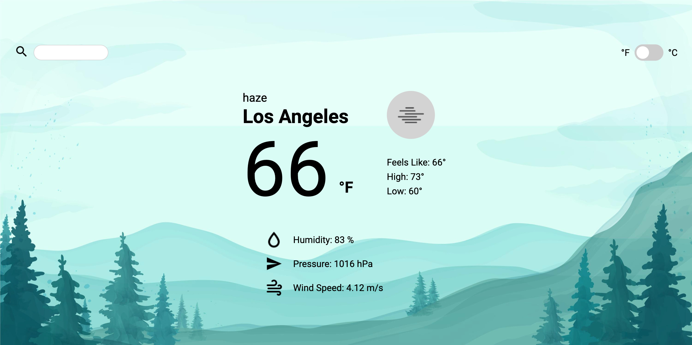

# Weather Now
A weather app utilizing Open Weather API with Async JS.  
[Live Demo](https://lemuellin.github.io/odin-weather-app/) :point_left:



## Features
-   Asynchronously fetches and extracts current weather data from Open Weather API
-   Interpreted and mediated JSON data from API into user-readable data
-   Toggle temperature data in metric or imperial units
-   Search a location for weather data
-   Implemented error checking that prevents users from creating error calls to API
-   Unique weather symbols for each forecast description
-   Mobile Responsive

## Technologies
-   Open Weather API
-   async / await / fetch
-   HTML5
-   CSS3
-   Vanilla Javascript

## Getting Started
##### Run
```
git clone https://git@github.com:lemuellin/odin-weather-app.git
cd odin-weather-app
```